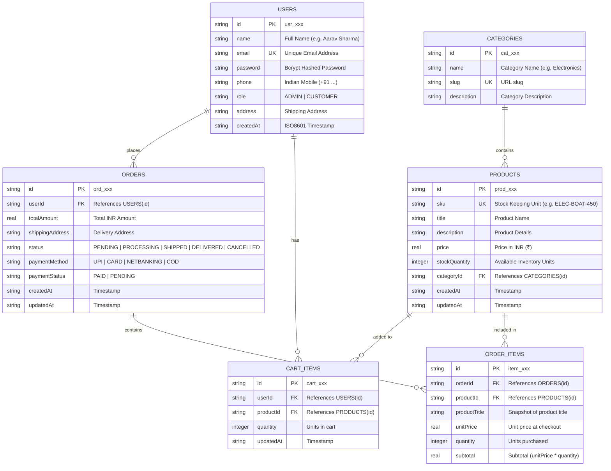

# BharatMart – E-Commerce & Inventory Management REST API

A modular, production-ready backend application built with **Node.js**, **Express**, and persistent **SQLite** for managing e-commerce catalogs, inventory stock, shopping carts, user authentication, and checkout order processing.
 
Developed specifically for the **ShadowFox Backend Developer Internship (Intermediate Level)**.

🌐 **Live Deployed API (Production):** [https://bharatmart-ecommerce-api.onrender.com](https://bharatmart-ecommerce-api.onrender.com)  
📡 **Live Health Check:** [https://bharatmart-ecommerce-api.onrender.com/api/v1/health](https://bharatmart-ecommerce-api.onrender.com/api/v1/health)

---

## 🌟 Key Features

* **Authentication & Authorization (JWT + Bcrypt):**
  * User registration and login with secure password hashing via `bcryptjs`.
  * Stateless **JSON Web Token (JWT)** verification via Bearer authorization headers.
* **Role-Based Access Control (RBAC):**
  * Strict permission boundaries between `ADMIN` and `CUSTOMER`.
  * Administrative access required to create products, modify prices, update inventory stock, view system-wide orders, and update shipping statuses.
* **Product Catalog & Real-Time Inventory:**
  * Search by keyword, filter by category and price range, and check stock availability.
  * Real-time stock decrementing upon order placement.
* **Shopping Cart System:**
  * Persistent shopping carts with quantity constraints against live warehouse inventory.
  * Automatic subtotal and Indian standard 18% GST calculation.
* **Atomic Order Checkout (Database Transactions):**
  * Checkout runs inside a strict database transaction (`BEGIN IMMEDIATE TRANSACTION ... COMMIT`).
  * Validates stock for each item, decrements warehouse inventory, inserts master order and line items, and empties user's cart atomically.
  * **Automatic Stock Restoration:** If an administrator marks an order as `CANCELLED`, all purchased quantities are automatically credited back into available product stock!
* **100% Indian Dataset:**
  * Indian user profiles (Delhi, Bengaluru, Mumbai, Gurugram), Indian brands and products (boAt, FabIndia, Biba, Prestige, Milton, Dabur, Patanjali), and Indian Rupee (₹) pricing.
* **Automated Integration Test Suite:**
  * Over 50 automated test assertions verifying authentication, RBAC, cart, and transactional edge cases (`npm test`).
* **Postman Collection v2.1:**
  * Ready-to-import Postman collection with automatic token extraction and environment variable management.

---

## 🏛 Project Architecture

```text
ecommerce-inventory-backend/
├── data/
│   └── bharatmart.db                  # SQLite database with foreign keys & indexes
├── src/
│   ├── config/
│   │   ├── env.js                     # Environment variable loader
│   │   └── database.js                # Schema, indexes, seed data & transaction runner
│   ├── controllers/
│   │   ├── auth.controller.js         # Register, login, profile handlers
│   │   ├── product.controller.js      # Product search & admin stock handlers
│   │   ├── cart.controller.js         # Cart operations
│   │   └── order.controller.js        # Checkout, order tracking, admin status updates
│   ├── middlewares/
│   │   ├── auth.middleware.js         # JWT verification & requireRole() RBAC guard
│   │   ├── error.middleware.js        # Centralized error handler
│   │   ├── notFound.middleware.js     # 404 route handler
│   │   └── validate.middleware.js     # Joi schema validation middleware
│   ├── repositories/
│   │   ├── user.repository.js         # User SQL queries
│   │   ├── category.repository.js     # Category SQL queries
│   │   ├── product.repository.js      # Product & inventory queries
│   │   ├── cart.repository.js         # Cart SQL queries
│   │   └── order.repository.js        # Order & order_items queries
│   ├── routes/
│   │   ├── auth.routes.js             # /api/v1/auth
│   │   ├── product.routes.js          # /api/v1/products
│   │   ├── cart.routes.js             # /api/v1/cart
│   │   ├── order.routes.js            # /api/v1/orders
│   │   └── index.js                   # Route aggregator & /health
│   ├── services/
│   │   ├── auth.service.js            # Password hashing, JWT signing
│   │   ├── product.service.js         # Inventory business logic
│   │   ├── cart.service.js            # Cart logic & stock checks
│   │   └── order.service.js           # Atomic checkout transaction & stock deductions
│   ├── utils/
│   │   ├── apiError.js                # Custom HTTP errors (400, 401, 403, 404, 409)
│   │   └── apiResponse.js             # Standardized JSON response envelope
│   ├── validators/
│   │   ├── auth.validator.js          # Joi schemas for auth
│   │   ├── product.validator.js       # Joi schemas for products
│   │   ├── cart.validator.js          # Joi schemas for cart
│   │   └── order.validator.js         # Joi schemas for orders
│   └── app.js                         # Express application pipeline
├── postman/
│   ├── BharatMart_API_Collection.json # Postman collection v2.1 with tests
│   └── BharatMart_Environment.json    # Environment file
├── tests/
│   └── runTests.js                    # 50+ automated integration tests
├── .env.example                       # Environment template
├── .env                               # Local configuration (Port 5002)
├── .gitignore                         # Git exclusion rules
├── package.json                       # Scripts and dependencies
├── server.js                          # Port 5002 entrypoint
└── README.md                          # Documentation & API specifications
```

---

## 🗄 Database Design & Schema (6 Relational Tables)



---

## 🔒 Role-Based Access Control (RBAC) Matrix

| Endpoint | Method | Public | Customer | Admin | Description |
| :--- | :---: | :---: | :---: | :---: | :--- |
| `/api/v1/auth/register` | `POST` | ✅ | ✅ | ✅ | Register user account |
| `/api/v1/auth/login` | `POST` | ✅ | ✅ | ✅ | Authenticate & get JWT token |
| `/api/v1/auth/me` | `GET` | ❌ | ✅ | ✅ | View authenticated user profile |
| `/api/v1/categories` | `GET` | ✅ | ✅ | ✅ | View all product categories |
| `/api/v1/categories/:id` | `GET` | ✅ | ✅ | ✅ | View single category with products |
| `/api/v1/products` | `GET` | ✅ | ✅ | ✅ | Search & browse product catalog |
| `/api/v1/products/:id` | `GET` | ✅ | ✅ | ✅ | View single product details |
| `/api/v1/products` | `POST` | ❌ | ❌ | ✅ | Add new product to inventory |
| `/api/v1/products/:id` | `PATCH` | ❌ | ❌ | ✅ | Update product / stock quantity |
| `/api/v1/products/:id` | `DELETE` | ❌ | ❌ | ✅ | Remove product from catalog |
| `/api/v1/cart/**` | `ALL` | ❌ | ✅ | ✅ | Manage active shopping cart |
| `/api/v1/orders/checkout` | `POST` | ❌ | ✅ | ✅ | Atomic checkout from cart |
| `/api/v1/orders/my-orders`| `GET` | ❌ | ✅ | ✅ | View own order history |
| `/api/v1/orders/:id` | `GET` | ❌ | ✅ (Own) | ✅ (Any) | View order line items |
| `/api/v1/orders/:id/cancel` | `POST` | ❌ | ✅ (Own Pending/Proc) | ✅ (Any) | Cancel order & restore stock |
| `/api/v1/orders/admin/all`| `GET` | ❌ | ❌ | ✅ | View all orders across system |
| `/api/v1/orders/:id/status`| `PATCH`| ❌ | ❌ | ✅ | Update status (Restores stock if cancelled) |

---

## 🚀 How to Run (Git Bash)

```bash
# 1. Navigate to project directory in Git Bash
cd "/c/Users/KULJEET/Desktop/INTERNSHIP/ecommerce-inventory-backend"

# 2. Install dependencies
npm install

# 3. Start server (runs on port 5002)
npm start

# 4. In a second Git Bash tab (or after stopping server), run the automated test suite
npm test
```

---

## 🔑 Pre-Seeded Indian Test Accounts

| Account Role | Email | Password | Phone |
| :--- | :--- | :--- | :--- |
| **Administrator** | `admin@bharatmart.in` | `Admin@123` | `+91 98201 23456` |
| **Customer** | `aarav.sharma@gmail.com` | `Customer@123` | `+91 98765 11223` |
| **Customer 2** | `pooja.gupta@yahoo.co.in` | `Customer@123` | `+91 98451 22334` |
